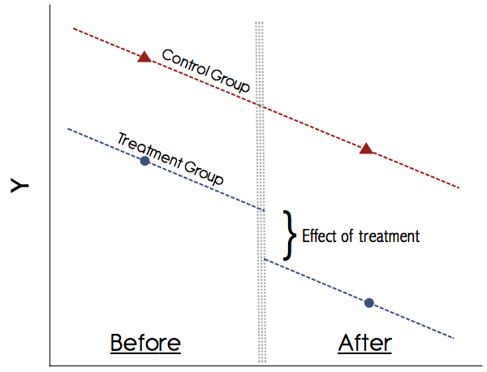
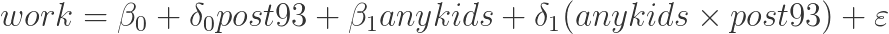

# Today's Agenda

1. Autocorrelation
2. Fixed, random, and mixed-effects regression
3. Differences-in-differences
4. Regression discontinuity
5. Spatial lag models
6. Learning R - what to do next?


# 1. Autocorrelation

Let us first load the LDC dataset.

```{r,tidy=TRUE}
setwd('C:/Users/Jan/OneDrive/Documents/GitHub/ps630_lab/')
library(foreign)
LDC=read.dta("LDC_IO_replication.dta")
```

We use a regression that we have already seen in the past to illustrate the phenomenon of autocorrelation. This is our standard regression in which we analyze the impact of democratization on tariff levels.

```{r,tidy=TRUE}
lm_basic=lm(newtar ~ l1polity + l1gdp_pc + l1lnpop + l1ecris2 + l1bpc1 + l1avnewtar + factor(ctylabel)-1, data = LDC)
# summary(lm_main)
```

There might be autocorrelation in our model because our units at time t and our units at time t-1 are likely to have similar values for the dependent and independent variables. Let us regress the residuals of our models on the residuals at time t-1:

```{r,tidy=TRUE}
res_t0=lm_basic$resid
res_t1=c(lm_basic$resid[2:length(lm_basic$resid)],NA)
res_data=as.data.frame(cbind(res_t1,res_t0))
head(res_data)
lm_res=lm(res_t1 ~ res_t0, data=res_data)
summary(lm_res)
```

What we can see from this simple regression is that there is a high level of autocorrelation in our errors. Note that this code can easily be extended to include multiple lags of our residuals, which you might want to do to check for autocorrelation for several observations.

To address this problem, if we have enough datapoints available, we can create lags of our dependent variable (and other variables) and then include them in a new regression. The *DataCombine* package is designed for data management, especially time series and panel data. It allows us to easily generate lags of our dependent variable.

install.packages("DataCombine")

```{r,tidy=TRUE}
library(DataCombine)

# summary(LDC)
```

We first define which variables we want to lag and we create a vector that includes prefixes for our lagged variables so that we can easily distinguish them from the non-lagged variables.

```{r,tidy=TRUE}
# Choose the variables you want to lag
toLag = c("newtar","polityiv_update2")

# Define vector with the lag numbers
numberLag = c("lag1_","lag2_","lag3_")

# For loop to lag the data
for (i in 1:3){
  for (lagVar in toLag){
    LDC=slide(LDC, Var=lagVar, # Specify variable to lag
                 TimeVar="date", # Specificy time variable
                 GroupVar="ctylabel", # Unit variable
                 NewVar=paste0(numberLag[i],lagVar), # Name of new variable
                 slideBy = -i, # Lag by how many units, minus -> past
                 keepInvalid = FALSE, # Keep observations for which no lag can be created
                 reminder = TRUE) # Remind you to order the data by group variable
  }
}
```

Let us now create a new model that contains three lags of the dependent variable.

```{r,tidy=TRUE}
lm_lag_dv=lm(newtar ~ lag1_newtar + lag2_newtar + lag3_newtar + l1polity + l1gdp_pc + l1lnpop + l1ecris2 + l1bpc1 + l1avnewtar + factor(ctylabel)-1, data = LDC)

# summary(lm_lag_dv)
```

How can we interpret the results of this model?

Also, there might be a time trend. Tariff levels might be moving up or down over time. If we can capture such a time trend with our model, it might reduce the autocorrelation in our errors.

```{r,tidy=TRUE}
lmTime=lm(newtar ~ lag1_newtar + lag2_newtar + lag3_newtar + l1polity + l1gdp_pc + l1lnpop + l1ecris2 + l1bpc1 + l1avnewtar + date + factor(ctylabel)-1, data = LDC)

# summary(lmTime)
```

How would we interpret the results of our regression?

Let us use data on the United States from **Castellacci & Natera (2011)** to illustrate how we can correct for autocorrelation using Newey West Standard Errors. Our theory here is that the number of patents (Patents) that were awarded in the US is a function of economic openness (Openness) and education expenditures (EducExp). Economic openness could be associated with both more opportunities to create innovations and more economic pressure due to higher levels of competition.

```{r,tidy=TRUE}
setwd("C:/Users/Jan/OneDrive/Documents/GitHub/ps630_lab/w13/")
load("USdata.Rdata")
lm_patents=lm(Patents ~ Openness + EducExp, data=USdata)
summary(lm_patents)
```

How would we interpret this regression? Why might autocorrelation bias our results here?

Let us use Newey West SE which correct for autocorrelation.

**Credit to Sascha Riaz for this part of the code.**

install.packages("sandwich")

install.packages("lmtest")

```{r,tidy=TRUE}
library(sandwich)
library(lmtest)

coeftest(lm_patents, NeweyWest(lm_patents, lag=3))
```

How did the regression results change using Newey West SE?


# 2. Fixed, random, and mixed-effects regression

Why would we use fixed effects? The main reason is that there might be many unobserved factors that contribute to heterogeneity across our units. For example, historical developments and country-specific peculiarities that we cannot easily measure (such as culture) could contribute to very different levels of, for instance, tariff levels. Let us illustrate the heterogeneity in tariff levels across countries using several plots.

Note that there are too many countries in our LDC dataset, so we will use an arbitrary subset of the data to demonstrate this.

```{r,tidy=TRUE}
LDC2=LDC[1:450,]
boxplot(newtar ~ ctylabel, par(las = 2), data=LDC2)
```

There are more plots to look at changes in variables over time for several units.

install.packages("gplots")

```{r,tidy=TRUE}
library(gplots)
coplot(newtar ~ date|ctylabel, data=LDC2)
plotmeans(newtar ~ ctylabel, data=LDC2)
```

How would one implement fixed effects? We have seen fixed effects previously. We can simply integrate fixed effects by using the `factor()` command.

There are two ways to use fixed effects.

```{r,tidy=TRUE}
# Estimates an intercept for every unit but omits an intercept
lm_fe1=lm(newtar ~ l1polity + l1gdp_pc + l1lnpop + l1avnewtar + factor(ctylabel)-1, data=LDC2)
# summary(lm_fe1)

# Estimates an intercept but omits Albania
lm_fe2=lm(newtar ~ l1polity + l1gdp_pc + l1lnpop + l1avnewtar + factor(ctylabel), data=LDC2)
# summary(lm_fe2)
```

Is there a substantive difference between those two models? Does one of them bias our results?

Now let's introduce random effects (RE). The term "random effects" can mean different things depending on the context. Although there are different meanings depending on the context, let us first refer to "random effects" as merely reflecting a procedure to estimate the **intercept** for each unit. In order to do this, we use the very useful *lme4* package.

install.packages("lme4")

```{r,tidy=TRUE}
library(lme4)
lm_re=lmer(newtar ~ l1polity + l1gdp_pc + l1lnpop + l1avnewtar + (1 | ctylabel), data=LDC2)
summary(lm_re)
```

How would we interpret this output?

Let us look specifically at the distribution of the intercept across different units.

```{r,tidy=TRUE}
coef(lm_re)$ctylabel

illustrate=coef(lm_re)$ctylabel

colnames(illustrate)[1]="intercept"

plot(density(illustrate$intercept))
```

How does this distribution look like?

Fortunately, the *lme4* package allows us to also estimate models in which our coefficients are randomly distributed --- a random coefficients model. As you learned in lecture, sometimes models that include both regular coefficients and random coefficients are labeled "mixed models". However, the definition may change depending on the context, so be careful about the use of this term.

```{r,tidy=TRUE}
lm_mixed=lmer(newtar ~ l1polity + l1gdp_pc + l1lnpop + l1avnewtar + (1 + l1polity | ctylabel), data=LDC2)
summary(lm_mixed)
```

How would we interpret these results? What is "mixed" in this model?

Let us look at how the coefficient changes from country to country.

```{r,tidy=TRUE}
coef(lm_mixed)$ctylabel

illustrate2=coef(lm_mixed)$ctylabel

plot(density(illustrate2$l1polity))
```

How would we interpret these differences?


# 3. Differences-in-differences

What is differences-in-differences (diff-in-diff)?

When we use a diff-in-diff design, we have two groups of units and we are interested in how one of the two groups is affected by an "exogeneous" treatment. In order to estimate the effect of the treatment, we make the so-called "parallel trends" assumption, i.e. we believe that the variable we are interested in moves would have moved in the same fashion if it was not for the treatment. The "control group is not affected by the treatment. The name "differences-in-differences" stems from the fact that we observe a variable that moves over time (has differences over time) and we are interested in how this movement is different between units.

Note that although I use experimental language, such as the terms "exogeneous", "treatment" and "control group", a diff-in-diff does not meet the same rigorous standards as a controlled, randomized experiment.

**The following content is from Kevin Goulding**.

The original can be found here:

https://thetarzan.wordpress.com/2011/06/20/differences-in-differences-estimation-in-r-and-stata/

The following plot illustrates the concept of differences-in-differences:



In order to illustrate differences-in-differences, we use a dataset that shows the effect of the *Earned Income Tax Credit (EITC)* that was introduced in 1993 and benefited women with children. The question we are interested in is: how did the EITC affect the employment status of women? Let us first load the dataset.

```{r,tidy=TRUE}
setwd("C:/Users/Jan/OneDrive/Documents/GitHub/ps630_lab/w13/")
eitc = read.dta("eitc.dta")
summary(eitc)
```

Our dependent variable is "work" - a binary variable indicating employment with 1.

We need a minimum of four groups to conduct a diff-in-diff analysis. Those groups are separated according to two categories - time point 1 and time point 2 to estimate the trend. And treatment group and control group to estimate the effect of the treatment. The EITC went into effect in the year 1994, meaning that the time before 1994 is our time point 1 and 1994 onwards is time point 2.

```{r,tidy=TRUE}
# We turn our logical vector into a numeric (1/0)
# The value "1" stands for 1994 onwards
eitc$post93 = as.numeric(eitc$year >= 1994)
```

As stated above, the EITC benefits women with children, so let us subset the data and only look at people with children.

```{r,tidy=TRUE}
# We create a new binary variable
# The value "1" stands for someone with 1 or more child(ren)
eitc$anykids = as.numeric(eitc$children >= 1)
```

Next we look at the means of the four possible combinations.

```{r,tidy=TRUE}
a = sapply(subset(eitc, post93 == 0 & anykids == 0, select=work), mean)
b = sapply(subset(eitc, post93 == 0 & anykids == 1, select=work), mean)
c = sapply(subset(eitc, post93 == 1 & anykids == 0, select=work), mean)
d = sapply(subset(eitc, post93 == 1 & anykids == 1, select=work), mean)
```

Finally, we compute the differences-in-differences by using the above four means.

```{r,tidy=TRUE}
(d-c)-(b-a)
```

How does this capture the causal effect?

Another way to look at this result is to take into account the following regression.



```{r,tidy=TRUE}
eitc$p93kids.interaction = eitc$post93*eitc$anykids
reg1 = lm(work ~ post93 + anykids + p93kids.interaction, data = eitc)
summary(reg1)
```

How would we interpret this output? What does it tell us about the four groups we created?

For more on diff-in-diff see the following sources:

Angrist & Pischke (2015) *Mastering 'Metrics*, Chapter 5

Angrist & Pischke (2009) *Mostly Harmless Econometrics*, Chapter 5.2

For a more comprehensive discussion of the above example, see the following website:

https://thetarzan.wordpress.com/2011/05/24/surviving-graduate-econometrics-with-r-difference-in-difference-estimation-2-of-8/


# 4. Regression discontinuity

Regression discontinuity designs are powerful tools for causal inference where a real randomized experiment is not feasible (like diff-in-diff). They make use of the existence of a cut-off point which is associated with only minor changes in a continuous/interval variable that are expected to lead to significant substantive effects between the affected units.

You were asked to read the article **Hidalgo & Nichter (2015) Voter Buying - Shaping the Electorate through Clientelism**. In this article, the authors show how the "random" introduction of voter auditing can affect the extent to which parties can buy votes. This is a good example of how applied political research can make use of as-if-random real-world discontinuities.

In order to illustrate RDD, let us first load an artificial dataset that contains medical expenditures by age for US citizens. We will make use of a discontinuity at the age of 65. In the United States, the medicare program helps citizens at and above the age of 65 to finance their medical expenditures. Although citizens at the age of 64 can be expected to not substantially differ from citizens at the age of 65 in terms of their medical needs, the fact that medicare supports citizens at the age of 65 indicates that there could be a discontinuity in medical expenditures at this cutoff point.

```{r,tidy=TRUE}
load("Medicare.Rdata")
summary(Medicare)
plot(Medicare$Age,Medicare$MedicalExp)
```

The plot does not really tell us what is going. There might or might not be a discontinuity at the age of 65. Let us use some RDD tools to figure this out.

**The following content is based on code from Matthieu Stigler.** Note that the R commands in the original instructions are based on an older version of the package. The modified commands are below.

The original can be found here: https://github.com/MatthieuStigler/RDDtools

We will use a package called "rddtools" to conduct this analysis.

install.packages("rddtools")

```{r,tidy=TRUE}
library(rddtools)
```

"rddtools" requires us to declare our data an rdd object so that it can apply the correct tools.

```{r,tidy=TRUE}
medicare_rdd <- rdd_data(y = Medicare$MedicalExp, # Dependent variable
                         x = Medicare$Age, # Key independent variable
                         covar = Medicare, # Dataset containing control variables
                         cutpoint = 65) # Our cutpoint
```

We can now apply "summary" and "plot" to get an overview of the data.

```{r,tidy=TRUE}
summary(medicare_rdd)
plot(medicare_rdd)
```

The plot shows the average values in each of the bins, where each bin. Unlike our scatterplot, it gives us a clear impression of whether or not there might be a discontinuity. Indeed, it appears that there is some discontinuity in our data.

Now, let us turn to parametric regression estimation. In this regression approach, we assume that we know the function that describes the data. Linear regression is a parametric regression because we assume a linear relationship of form y = a + bx. The "rddtools" package allows us to include polynomials of different order in our regression to estimate non-linear regressions. Even with a discontinuity, there might be non-linear relationships. 

```{r,tidy=TRUE}
reg_para <- rdd_reg_lm(rdd_object = medicare_rdd,
                       order = 1,
                       bw=10) # Bandwidth of the regression discontinuity
reg_para
```

How would we interpret this result?

Now let us plot the regression.

```{r,tidy=TRUE}
plot(reg_para)
```

Alternatively, let us use a regression with a higher-order polynomial.

```{r,tidy=TRUE}
reg_para2 <- rdd_reg_lm(rdd_object = medicare_rdd, order = 4)
reg_para2
plot(reg_para2)
```

Note: if we have control variables, we can include those control variables in the following way:

```{r,tidy=TRUE}
reg_para3 <- rdd_reg_lm(rdd_object = medicare_rdd,
                        covariates = "covariate1 + covariate2",
                        order = 4)
reg_para3
summary(reg_para3)
```

The following command computes the "optimal bandwidth" of the RDD, following a procedure by Imbens, Guido and Karthik Kalyanaraman (2012).

```{r,tidy=TRUE}
bw_ik <- rdd_bw_ik(medicare_rdd)
bw_ik
```

Non-parametric regression refers to regressions where we do not make any assumptions about the function that links our variables.

```{r,tidy=TRUE}
reg_nonpara <- rdd_reg_np(rdd_object = medicare_rdd, bw = bw_ik)
print(reg_nonpara)
```

Next, we plot the nonparametric regression.

```{r,tidy=TRUE}
plot(x = reg_nonpara)
```

Let us apply a regression sensitivity test. This plot shows us how our results change if we use different bandwidths for estimating the differences. In the example below we look at bandwidths 5 to 25.

```{r,tidy=TRUE}
plotSensi(reg_nonpara, from = 5, to = 25, by = 1)
```

How would we interpret these results?

Another way to check the robustness of our results is a placebo test. Here we check for other values in the regression discontinuity whether they would yield any significant results.

```{r,error=TRUE}
plotPlacebo(reg_para2)
```

How would we interpret this plot?

Another problem that might arise in regression discontinuity designs is that there might be some units that should not have been treated but were treated. For example, assume in our case that some 63- or 64-year olds who are in need of medical treatment deliberately claim that they are 65 year old to receive treatment. In this case, we would observe an unnatural discontinuity in the density of values around the threshold. The following command allows us to conduct such a test:

```{r,tidy=TRUE}
dens_test(reg_nonpara)
```

How would we interpret these results? Considering the p-value, should we have more or less confidence in our estimates?

Finally, we can check whether or not our discontinuity comes from covariates. In our example of medicare expenditures, we could assume that several factors can contribute to the increase in medical expenditures. For example, many people stop working at the age of 65. Maybe people who do not work anymore become bored and go to the doctor more frequently to talk to someone. If we have data on whether or not people are still in employment, we could use this covariate test to identify whether or not the employment status after 65 primarily contributes to the spike in medical expenditures.

The following test shows us whether there is a significant difference in the covariates around the threshold with a bandwidth of 5.

```{r,tidy=TRUE}
covarTest_mean(medicare_rdd, bw = 5)
```

How would we interpret this output?


## RDD replication dataset: Hidalgo & Nichter (2015)

If you would like to see another implementation of RDD based on the article that you have read, please check out the data and replication files that have been made available by **Hidalgo & Nichter (2015) Voter Buying - Shaping the Electorate through Clientelism**. The replication files include both the data and the code, making it possible for you to follow their steps one by one. It can be found here:

https://dataverse.harvard.edu/dataset.xhtml?persistentId=doi:10.7910/DVN/9OOLQ7

Note that their code is very complex, so you should only look at it when you plan to implement RDD yourself.


# 5. Spatial lag models

**The following content is based on code from Kyle Beardsley.**

For the application of a spatial lag model, we will need the package "cshapes".

install.packages("cshapes")

```{r,tidy=TRUE}
library(cshapes)
```

We first load the Uppsala Conflict Data Program (UCDP) intrastate conflict data.

```{r,tidy=TRUE}
setwd("C:/Users/Jan/OneDrive/Documents/GitHub/ps630_lab/w13/")
ucdp = read.csv("ucdp_1onset2012.csv")
summary(ucdp)
ucdp = ucdp[ucdp$incidencev412==1,]
```

We use this data to form neighborhood connectivity matrices and associated data for 2005

Specifically, we use the cshapes distmatrix (distance matrix) function to form a matrix of distances in 2005

```{r,tidy=TRUE}
# Distance matrix with distance between capitals in km
dmat = distmatrix(as.Date("2005-1-1"), type="capdist")
```

Let us inspect the object that we created.

Note: the cshapes package uses countrycodes. These countrycodes follow the coding scheme of the Correlates of War Project (COW) or Gleditsch and Ward (1999). So what we see here are not country names.

Next, we define neighbors as having a distance of less than 900km.

```{r,tidy=TRUE}
# Adjacency matrix with values 0 and 1
adjmat = ifelse(dmat > 900, 0, 1)
```

Turn the values on the diagonale into zeros. (States do are not neighbors of themselves)

```{r,tidy=TRUE}
diag(adjmat) = 0
```

"adjmat"" is now the connectivity matrix with 1 implying a connection and 0 no connection.

Some countries have more neighbors than others. We would expect each neighbor to have a smaller influence if the country has many neighbors, so we row-standardize by taking each element and dividing by the row sums.

```{r,tidy=TRUE}
adjmat_rs = adjmat
for (i in 1:dim(adjmat)[1]){
  adjmat_rs[i,] = adjmat_rs[i,]/colSums(adjmat, 1)[i]
}
```

"adjmat_rs"" is now the row-standardized connectivity matrix (W) for use in the spatial lag model.

Note that values are missing for rows in which there are no neighbors.

Next, we form country-level data with neighbor information in 2005.

For this purpose, we need to get the get the country codes.

```{r,tidy=TRUE}
# Extract the codes from the row names
codes = row.names(adjmat)

# Turn the codes into a data frame
nbr = data.frame(codes)
```

Now we create a variable for whether the country experienced an intrastate armed conflict in 2005.

```{r,tidy=TRUE}
# If a country is in the intrastate armed conflict set in the year 2005, we assign a 1
nbr$intra = ifelse(codes %in% ucdp$gwno[ucdp$year==2005]==TRUE,1,0)
```

Then, we create a temporal lag variable, which will be used to form the spatial lags and avoid simultaneity bias

```{r,tidy=TRUE}
# If a country experienced an intrastate armed conflict in the year 2004, we assign a 1
nbr$intra_lag = ifelse(codes %in% ucdp$gwno[ucdp$year==2004]==TRUE,1,0)
```

We move on to compute the number of conflicts that all the neighbors had in the previous year, by multiplying the non-standarized connectivity matrix times the lagged conflict variable.

```{r,tidy=TRUE}
nbr$nbr_intra = adjmat %*% nbr$intra_lag
```

Then we calculate the number of neighbors each state has.

```{r,tidy=TRUE}
ones = matrix(1,ncol=1,nrow=dim(nbr)[1])
nbr$borders = adjmat %*% ones
```

We then put in the year.

```{r,tidy=TRUE}
nbr$year = matrix(2005,ncol=1,nrow=dim(nbr)[1])
```

Finally, we compute Wy (actually Wy_[t-1]).

Note that this is the same as the number of neighboring conflicts divided by the number neighbors (nbr_intra/borders).

```{r,tidy=TRUE}
nbr$nbr_intra_rs = adjmat_rs %*% nbr$intra_lag
```

Finally, we run the spatial lag model, controlling for number of borders. Note that because the DV is binary (0/1), this is a linear probability model. This is not ideal, but useful for the example.

```{r,tidy=TRUE}
spat_lag = lm(intra~nbr_intra_rs + borders, data=nbr)
summary(spat_lag)
```

How would we interpret this output?


# 6. Learning R - what to do next?

Here are some pieces of advice on how to proceed from here.

First, when you have some free time during the winter break, use it to review what you have learned in this class. You will need it in the future.

The following classes are most useful in terms of pushing your R skills further:

1. PolSci 733 - *Maximum Likelihood Methods* (2nd semester)
2. Stats 523 - *Statistical Programming* (3rd semester/5th semester)
3. Stats 601 - *Bayesian and Modern Statistics* (4th semester/6th semester)

Note: R is best learned gradually. Don't take everything at once. Give yourself the opportunity to learn more in the future.

Also, Stats 250 has an R lab, too. This R lab focuses on introducing R for mathematical purposes in the context of statistical theory (and it does not assume a background in R).

The following books will help you to master R:

1. Fox & Weisberg (2010) *An R Companion to Applied Regression* (2nd Edition)
2. Gelman & Hill (2006) *Data Analysis Using Regression and Multilevel/Hierarchical Models*
3. Chang (2013) *R Graphics Cookbook*
4. Kabacoff (2011) *R in Action*
5. Maindonald & Braun (2010) *Data analysis and graphics using R*
6. Matloff (2011) *The Art of R Programming - a Tour of Statistical Software Design*

In the future, you will often find yourself in the situation that the tutorial has not covered a problem you run into. Then you need to be able to find a solution yourself. Taking advanced classes in R will also help you to *develop* a solution yourself, i.e. to write your own script in R to deal with the problem.

R is a continuous learning experience.


## Remember

From our first session.

```{r,tidy=TRUE}
fun=c("R","is","fun")
paste(fun, collapse=" ")
```