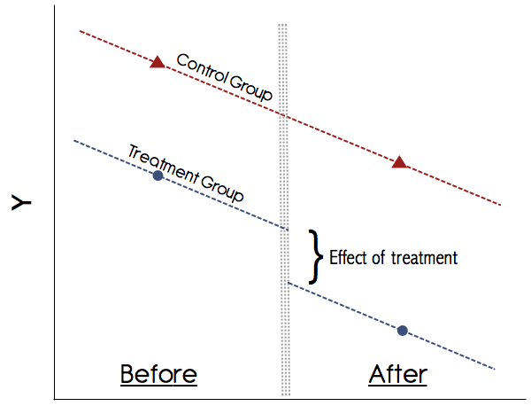

# Today's Agenda

1. Descriptive summary statistics
2. Differences-in-differences
3. Regression discontinuity


# 1. Descriptive summary statistics

In the past tutorials, we have learned how to turn our regression results into a table for LaTeX through the package "stargazer". Sometimes you might want to show some descriptive summary statistics, too. Fortunately, there is a package our there that allows one to easily display descriptive summary statistics for variables in LaTeX.

Let us use our LDC dataset to illustrate this.

```{r,tidy=TRUE}
setwd('C:/Users/Jan/OneDrive/Documents/GitHub/ps630_lab/ps630_f16/')
library(foreign)
LDC=read.dta("LDC_IO_replication.dta")
```

The package we will use to display summary statistics is called "reporttools".

install.packages("reporttools")

```{r,tidy=TRUE,results="hide"}
library(reporttools)

varsLDC <- LDC[, c("newtar", "fdignp", "polityiv_update2", "gdp_pc_95d")]
capLDC <- "Descriptive Statistics: LDC dataset"
tableContinuous(vars = varsLDC, cap = capLDC, lab = "tab: cont1", longtable = F, prec=2)
```

The output code (which is hidden here to save space) can easily be used in LaTeX.


# 2. Differences-in-differences

What is differences-in-differences (diff-in-diff)?

When we use a diff-in-diff design, we have two groups of units and we are interested in how one of the two groups is affected by an "exogeneous" treatment. In order to estimate the effect of the treatment, we make the so-called "parallel trends" assumption, i.e. we believe that the variable we are interested in moves would have moved in the same fashion if it was not for the treatment. The "control group is not affected by the treatment. The name "differences-in-differences" stems from the fact that we observe a variable that moves over time (has differences over time) and we are interested in how this movement is different between units.

Note that although I use experimental language, such as the terms "exogeneous", "treatment" and "control group", a diff-in-diff does not meet the same rigorous standards as a controlled, randomized experiment.

**The following content is from Kevin Goulding**.

The original can be found here:

https://thetarzan.wordpress.com/2011/06/20/differences-in-differences-estimation-in-r-and-stata/

The following plot illustrates the concept of differences-in-differences:



In order to illustrate differences-in-differences, we use a dataset that shows the effect of the *Earned Income Tax Credit (EITC)* that was introduced in 1993 and benefited women with children. The question we are interested in is: how did the EITC affect the employment status of women? Let us first load the dataset.

```{r,tidy=TRUE}
setwd("C:/Users/Jan/OneDrive/Documents/GitHub/ps630_lab/ps630_f16/W11/")
eitc = read.dta("eitc.dta")
summary(eitc)
```

Our dependent variable is "work" - a binary variable indicating employment with 1.

We need a minimum of four groups to conduct a diff-in-diff analysis. Those groups are separated according to two categories - time point 1 and time point 2 to estimate the trend. And treatment group and control group to estimate the effect of the treatment. The EITC went into effect in the year 1994, meaning that the time before 1994 is our time point 1 and 1994 onwards is time point 2.

```{r,tidy=TRUE}
# We turn our logical vector into a numeric (1/0)
# The value "1" stands for 1994 onwards
eitc$post93 = as.numeric(eitc$year >= 1994)
```

As stated above, the EITC benefits women with children, so let us subset the data and only look at people with children.

```{r,tidy=TRUE}
# We create a new binary variable
# The value "1" stands for someone with 1 or more child(ren)
eitc$anykids = as.numeric(eitc$children >= 1)
```

Next we look at the means of the four possible combinations.

```{r,tidy=TRUE}
a = sapply(subset(eitc, post93 == 0 & anykids == 0, select=work), mean)
b = sapply(subset(eitc, post93 == 0 & anykids == 1, select=work), mean)
c = sapply(subset(eitc, post93 == 1 & anykids == 0, select=work), mean)
d = sapply(subset(eitc, post93 == 1 & anykids == 1, select=work), mean)
```

Finally, we compute the differences-in-differences by using the above four means.

```{r,tidy=TRUE}
(d-c)-(b-a)
```

How does this capture the causal effect?

Another way to look at this result is to take into account the following regression.


```{r,tidy=TRUE}
eitc$p93kids.interaction = eitc$post93*eitc$anykids
reg1 = lm(work ~ post93 + anykids + p93kids.interaction, data = eitc)
summary(reg1)
```

How would we interpret this output? What does it tell us about the four groups we created?

For more on diff-in-diff see the following sources:

Angrist & Pischke (2015) *Mastering 'Metrics*, Chapter 5

Angrist & Pischke (2009) *Mostly Harmless Econometrics*, Chapter 5.2

For a more comprehensive discussion of the above example, see the following website:

https://thetarzan.wordpress.com/2011/05/24/surviving-graduate-econometrics-with-r-difference-in-difference-estimation-2-of-8/


# 3. Regression discontinuity designs

Regression discontinuity designs are powerful tools for causal inference where a real randomized experiment is not feasible (like diff-in-diff). They make use of the existence of a cut-off point which is associated with only minor changes in a continuous/interval variable that are expected to lead to significant substantive effects between the affected units.

You were asked to read the article **Hidalgo & Nichter (2015) Voter Buying - Shaping the Electorate through Clientelism**. In this article, the authors show how the "random" introduction of voter auditing can affect the extent to which parties can buy votes. This is a good example of how applied political research can make use of as-if-random real-world discontinuities.

In order to illustrate RDD, let us first load an artificial dataset that contains medical expenditures by age for US citizens. We will make use of a discontinuity at the age of 65. In the United States, the medicare program helps citizens at and above the age of 65 to finance their medical expenditures. Although citizens at the age of 64 can be expected to not substantially differ from citizens at the age of 65 in terms of their medical needs, the fact that medicare supports citizens at the age of 65 indicates that there could be a discontinuity in medical expenditures at this cutoff point.

```{r,tidy=TRUE}
load("Medicare.Rdata")
summary(Medicare)
plot(Medicare$Age,Medicare$MedicalExp)
```

The plot does not really tell us what is going. There might or might not be a discontinuity at the age of 65. Let us use some RDD tools to figure this out.

**The following content is based on code from Matthieu Stigler.** Note that the R commands in the original instructions are based on an older version of the package. The modified commands are below.

The original can be found here: https://github.com/MatthieuStigler/RDDtools

We will use a package called "rddtools" to conduct this analysis.

install.packages("rddtools")

```{r,tidy=TRUE}
library(rddtools)
```

"rddtools" requires us to declare our data an rdd object so that it can apply the correct tools.

```{r,tidy=TRUE}
medicare_rdd <- rdd_data(y = Medicare$MedicalExp, # Dependent variable
                         x = Medicare$Age, # Key independent variable
                         covar = Medicare, # Dataset containing control variables
                         cutpoint = 65) # Our cutpoint
```

We can now apply "summary" and "plot" to get an overview of the data.

```{r,tidy=TRUE}
summary(medicare_rdd)
plot(medicare_rdd)
```

The plot shows the average values in each of the bins, where each bin. Unlike our scatterplot, it gives us a clear impression of whether or not there might be a discontinuity. Indeed, it appears that there is some discontinuity in our data.

Now, let us turn to parametric regression estimation. In this regression approach, we assume that we know the function that describes the data. Linear regression is a parametric regression because we assume a linear relationship of form y = a + bx. The "rddtools" package allows us to include polynomials of different order in our regression to estimate non-linear regressions. Even with a discontinuity, there might be non-linear relationships. 

```{r,tidy=TRUE}
reg_para <- rdd_reg_lm(rdd_object = medicare_rdd,
                       order = 1,
                       bw=10) # Bandwidth of the regression discontinuity
reg_para
```

How would we interpret this result?

Now let us plot the regression.

```{r,tidy=TRUE}
plot(reg_para)
```

Alternatively, let us use a regression with a higher-order polynomial.

```{r,tidy=TRUE}
reg_para2 <- rdd_reg_lm(rdd_object = medicare_rdd, order = 4)
reg_para2
plot(reg_para2)
```

Note: if we have control variables, we can include those control variables in the following way:

```{r,tidy=TRUE}
reg_para3 <- rdd_reg_lm(rdd_object = medicare_rdd,
                        covariates = "covariate1 + covariate2",
                        order = 4)
reg_para3
summary(reg_para3)
```

The following command computes the "optimal bandwidth" of the RDD, following a procedure by Imbens, Guido and Karthik Kalyanaraman (2012).

```{r,tidy=TRUE}
bw_ik <- rdd_bw_ik(medicare_rdd)
bw_ik
```

Non-parametric regression refers to regressions where we do not make any assumptions about the function that links our variables.

```{r,tidy=TRUE}
reg_nonpara <- rdd_reg_np(rdd_object = medicare_rdd, bw = bw_ik)
print(reg_nonpara)
```

Next, we plot the nonparametric regression.

```{r,tidy=TRUE}
plot(x = reg_nonpara)
```

Let us apply a regression sensitivity test. This plot shows us how our results change if we use different bandwidths for estimating the differences. In the example below we look at bandwidths 5 to 25.

```{r,tidy=TRUE}
plotSensi(reg_nonpara, from = 5, to = 25, by = 1)
```

How would we interpret these results?

Another way to check the robustness of our results is a placebo test. Here we check for other values in the regression discontinuity whether they would yield any significant results.

```{r,error=TRUE}
plotPlacebo(reg_para2)
```

How would we interpret this plot?

Another problem that might arise in regression discontinuity designs is that there might be some units that should not have been treated but were treated. For example, assume in our case that some 63- or 64-year olds who are in need of medical treatment deliberately claim that they are 65 year old to receive treatment. In this case, we would observe an unnatural discontinuity in the density of values around the threshold. The following command allows us to conduct such a test:

```{r,tidy=TRUE}
dens_test(reg_nonpara)
```

How would we interpret these results? Considering the p-value, should we have more or less confidence in our estimates?

Finally, we can check whether or not our discontinuity comes from covariates. In our example of medicare expenditures, we could assume that several factors can contribute to the increase in medical expenditures. For example, many people stop working at the age of 65. Maybe people who do not work anymore become bored and go to the doctor more frequently to talk to someone. If we have data on whether or not people are still in employment, we could use this covariate test to identify whether or not the employment status after 65 primarily contributes to the spike in medical expenditures.

The following test shows us whether there is a significant difference in the covariates around the threshold with a bandwidth of 5.

```{r,tidy=TRUE}
covarTest_mean(medicare_rdd, bw = 5)
```

How would we interpret this output?


## RDD replication dataset: Hidalgo & Nichter (2015)

If you would like to see another implementation of RDD based on the article that you have read, please check out the data and replication files that have been made available by **Hidalgo & Nichter (2015) Voter Buying - Shaping the Electorate through Clientelism**. The replication files include both the data and the code, making it possible for you to follow their steps one by one. It can be found here:

https://dataverse.harvard.edu/dataset.xhtml?persistentId=doi:10.7910/DVN/9OOLQ7

Note that their code is very complex, so you should only look at it when you plan to implement RDD yourself.


